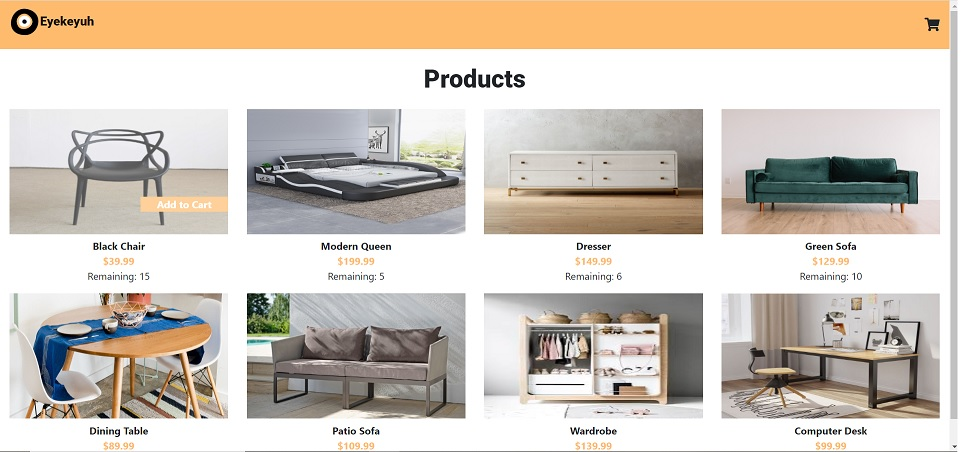

# Shopping-Cart
Simulated full-stack eCommerce website created using JavaScript, jQuery, Bootstrap, Node.js, Express, Handlebars, SQL and Sequelize.

User:  
-Add items from database to shopping cart, adjust quantities and view totals in cart, checkout to remove items from database. 

## Deployed URL: https://radiant-journey-40873.herokuapp.com/shop

### Front End:  
-Bootstrap CSS for responsive design  
-jQuery event handlers and AJAX requests (GET, PUT)  
-Local storage to save cart over multiple sessions  

### Server:  
-Node modules and packages for Express, Express-Handlebars, Sequelize, MySQL2, and Nodemon for Development  
-Express server creation and route handling through Controller  
-HTML rendering through Express-Handlebars  

### Database:  
-MySQL database connection and Table/Model established through Sequelize  
-JavaScript Sequelize queries to simulate SQL Read and Update  

Future development:  
-Adjust user input based on remaining stock (prevent overage)  
-Sort by categories, additional pages  
